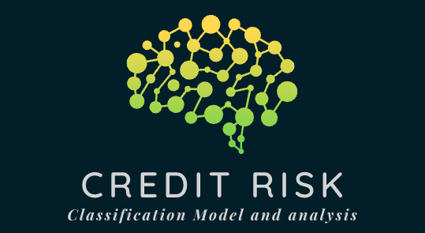

# Credit Risk Classification Analysis Report 

The purpose of this analysis is build a model that can identify the creditworthiness of borrowers. We used a dataset of historical lending activity from a peer-to-peer lending services company to build the model. Such dataset, included information on 'loan_status' as a binary input (0 = healthy loan, 1 = high risk loan), which we used as our target data for the model. We then created the variable 'y' containing the 'loan_status' data, and checked the amount of values of each input, 0 = 75036 and 1 = 2500, which made us understand that we needed to use techniques to train and evaluate models with imbalanced classes. 

## Steps taken to produce the analysis

    1- Split the Data into Training and Testing Sets

    2- Create a Logistic Regression Model with the Original Data by: 
        - instantiating the logistic regression model, 
        - scaling the data, 
        - fitting the model, and 
        - predicting the data.

    3- Predict a Logistic Regression Model with Resampled Training Data by:
        - instantiating the random oversampler model, 
        - fit the original training data to the random_oversampler model, 
        - instantiating the logistic regression model, 
        - scaling the resampled data, 
        - fitting the model with the scaled resampled data, and 
        - predicting the data.

We used a logistic regression model because it is a statistical analysis method that is able to predict binary outputs (0,1) based on the other information present in the dataset, and we used random oversampler model due to the imbalanced classes in our target variable (as described aboved), which balanced out the data (0 = 56271, 1= 56271).

## Results

Using bulleted lists, describe the balanced accuracy scores and the precision and recall scores of all machine learning models.

* Machine Learning Model 1: Logistic Regression Model with the Original Data
  * Accuracy: The model performed at a 98.89%
  * Precision scores: the precision score for predicting healthy loans was 100%, while for high risk loans was 84%, and with a total average of 99%
  * Recall scores: the recall score for predicting healthy loans was 99%, while for high risk loans was 98%, and with a total average of 99% 

* Machine Learning Model 2: Logistic Regression Model with Resampled Training Data
  * Accuracy: The model performed at a 99.36%
  * Precision scores: the precision score for predicting healthy loans was 100%, while for high risk loans was 84%, and with a total average of 99%
  * Recall scores: the recall score for predicting healthy loans was 99%, while for high risk loans was 99%, and with a total average of 99% 

## Summary

Both logistic regression models, with the original data and with the resampled data, have a high accuracy rate performing at over 98% and 99% respectively. The oversampler model improved the balanced accuracy score of the original model by 0.47%, and also the recall of the high risk loans by 1%. However, it did not managed to improve the precision score of the high risk loans, which remain at 84%. 

In our case, it is more important to consider the accuracy of the precision scores for high risk loans ('1') as they represent the instances in which the model predicted them as positive, or healthy loans (0) but were actually negative, or high risk loans (1). The models achieved the same score in this area, and as there was not a great improvement in any other result, it is recommended to use the logistic regression model with the original data. 
